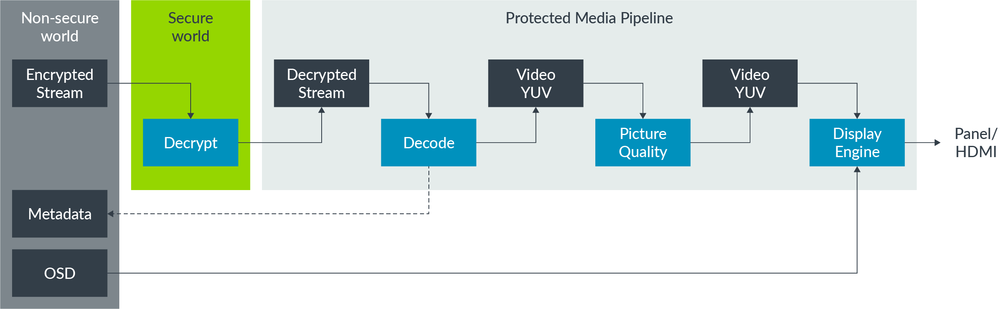
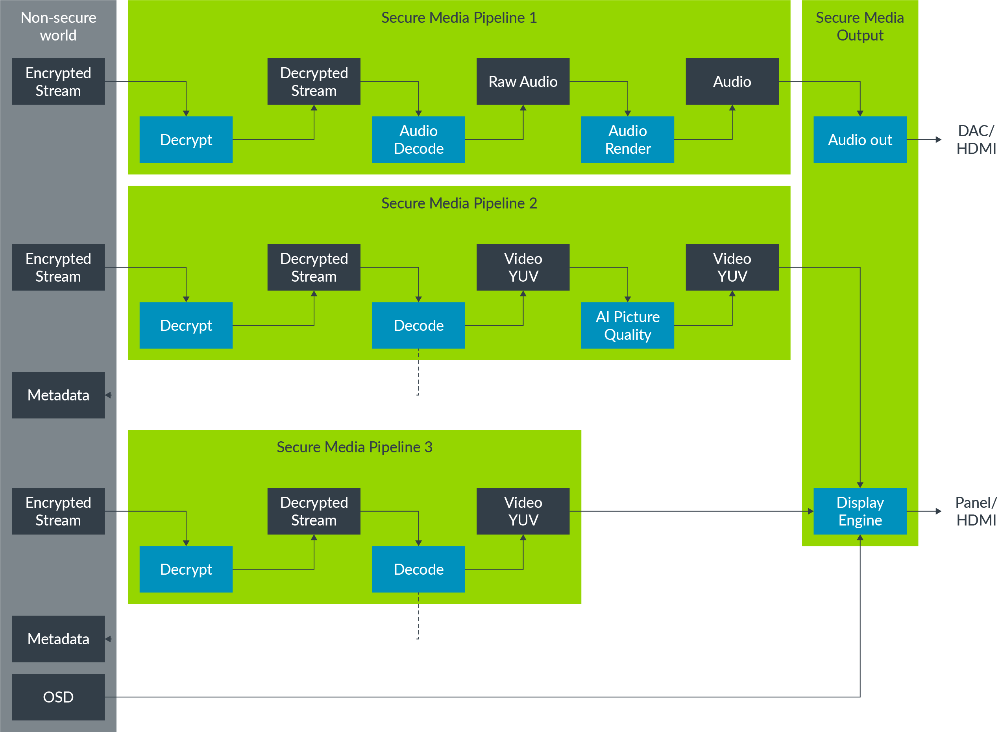
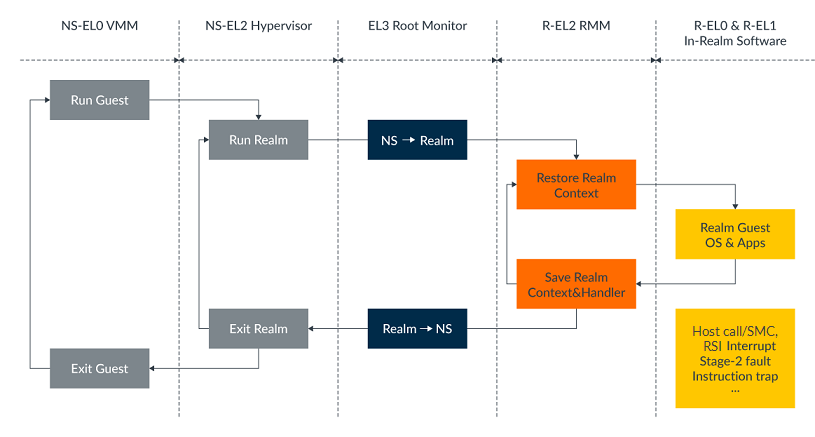

#-*- mode: org -*-
#+STARTUP: showall noinlineimages

* Tasks
** DONE Build Duck
CLOSED: [2023-04-18 Tue 15:46] SCHEDULED: <2023-04-18 Tue>
:LOGBOOK:
CLOCK: [2023-04-17 Mon 18:51]--[2023-04-17 Mon 18:51] =>  0:00
:END:
[2023-04-17 Mon]
** DONE Настроить рабочую среду для Duck, HM, HMVirt
CLOSED: [2023-04-19 Wed 16:31] SCHEDULED: <2023-04-21 Fri>
:LOGBOOK:
CLOCK: [2023-04-19 Wed 10:26]--[2023-04-19 Wed 10:27] =>  0:01
:END:
[2023-04-19 Wed]
** IN_REVIEW Integration of Raspberry PI into Duck CI
После этого можно перейти к обсуждению большого задания на probation period.
SCHEDULED: <2023-04-26 Wed>
:LOGBOOK:
CLOCK: [2023-04-20 Thu 11:24]--[2023-04-20 Thu 11:26] =>  0:02
:END:
[2023-04-20 Thu]
*** DONE Add Cleware invocation to CI
CLOSED: [2023-04-24 Mon 16:00]
:LOGBOOK:
CLOCK: [2023-04-20 Thu 11:28]--[2023-04-20 Thu 11:28] =>  0:00
:END:
[2023-04-20 Thu]
[[file:~/org/dev.org::*Integration of Raspberry PI into Duck CI][Integration of Raspberry PI into Duck CI]]
*** DONE Test on separate computer all of the scripts
CLOSED: [2023-04-27 Thu 11:30]
:LOGBOOK:
CLOCK: [2023-04-20 Thu 11:29]--[2023-04-20 Thu 11:29] =>  0:00
:END:
[2023-04-20 Thu]
[[file:~/org/dev.org::*Integration of Raspberry PI into Duck CI][Integration of Raspberry PI into Duck CI]]
*** NEXT Install hardware in the server room
- State "NEXT"       from "HOLD"       [2023-05-04 Thu 09:53]
- State "HOLD"       from "NEXT"       [2023-04-28 Fri 13:53] \\
  Waiting for static IP approval, after this we may state a migration
:LOGBOOK:
CLOCK: [2023-04-20 Thu 11:29]--[2023-04-20 Thu 11:29] =>  0:00
:END:
[2023-04-20 Thu]
[[file:~/org/dev.org::*Integration of Raspberry PI into Duck CI][Integration of Raspberry PI into Duck CI]]
*** Repository and commands                                         :JOURNAL:
:LOGBOOK:
CLOCK: [2023-04-20 Thu 11:30]--[2023-04-20 Thu 11:35] =>  0:05
:END:
<2023-04-20 Thu>
[2023-04-20 Thu 11:30]

[[file:~/org/dev.org::*Add Cleware invocation to CI][Add Cleware invocation to CI]]

Repository address:
[[https://rnd-gitlab-eu-c.huawei.com/germany-research-center/dresden-lab/ententeich/cleware-tools][GitLab]]

*** sw10098 pinout                                                  :JOURNAL:
:LOGBOOK:
CLOCK: [2023-04-20 Thu 11:42]--[2023-04-20 Thu 11:42] =>  0:00
:END:
<2023-04-20 Thu>
[2023-04-20 Thu 11:42]

[[file:~/org/dev.org::*Add Cleware invocation to CI][Add Cleware invocation to CI]]
red power, black ground, white RX into USB port, and green TX out of the USB port

*** For some reason this does not work, need to investigate         :JOURNAL:
:LOGBOOK:
CLOCK: [2023-04-26 Wed 10:02]--[2023-04-26 Wed 10:05] =>  0:03
:END:
<2023-04-26 Wed>
[2023-04-26 Wed 10:01]

[[file:~/dev/duck/scripts/cmake/ententeich.cmake::COMMAND mkdir -p ${CLEWARE_USB_SWITCH_SRCDIR}/build && cd ${CLEWARE_USB_SWITCH_SRCDIR} cmake -G Ninja ../ && ninja tools/USBswitchCMD]]

The point is to make a separate rule that is invoked only once (build of USBswitcherCMD application).
Jonathan said that I may use add_custom_command() together with add_custom_target().
Let's try.
*** Merge request link                                              :JOURNAL:
:LOGBOOK:
CLOCK: [2023-04-27 Thu 16:37]--[2023-04-27 Thu 16:37] =>  0:00
:END:
<2023-04-27 Thu>
[2023-04-27 Thu 16:37]

[[file:~/org/dev.org::*Integration of Raspberry PI into Duck CI][Integration of Raspberry PI into Duck CI]]

[[https://rnd-gitlab-eu-c.huawei.com/germany-research-center/dresden-lab/ententeich/duck/-/merge_requests/985]]
*** Requisites of intel NUC device that is connected to RPI4b       :JOURNAL:
:LOGBOOK:
CLOCK: [2023-04-28 Fri 12:12]--[2023-04-28 Fri 12:16] =>  0:04
:END:
<2023-04-28 Fri>
[2023-04-28 Fri 12:12]

[[file:~/org/dev.org::*Integration of Raspberry PI into Duck CI][Integration of Raspberry PI into Duck CI]]

IP address: 10.206.133.78
Login: duck
Password: drc-NUC-ententeich

Do not forget to call:
#+BEGIN_SRC shell
ssh-add
#+END_SRC

It is advised to ssh using `ssh -A` command.
It sill forward all known identities that may be useful
while interacting with git etc.
*** IP address of RPI4b device                                      :JOURNAL:
:LOGBOOK:
CLOCK: [2023-04-28 Fri 13:34]--[2023-04-28 Fri 13:35] =>  0:01
:END:
<2023-04-28 Fri>
[2023-04-28 Fri 13:34]

[[file:~/org/dev.org::*Integration of Raspberry PI into Duck CI][Integration of Raspberry PI into Duck CI]]

Address: 10.206.133.88
Netmask: 255.255.255.0
MAC: d8:3a:dd:06:b4:ff
*** CANCELLED Contact some guy regarding a static IP for RPI4b    :CANCELLED:
CLOSED: [2023-05-04 Thu 09:53] SCHEDULED: <2023-05-02 Tue>
- State "CANCELLED"  from "DONE"       [2023-05-04 Thu 09:53] \\
  Guy did not respond
:LOGBOOK:
CLOCK: [2023-04-28 Fri 13:36]--[2023-04-28 Fri 13:38] =>  0:02
:END:
[2023-04-28 Fri]
[[file:~/org/dev.org::*Integration of Raspberry PI into Duck CI][Integration of Raspberry PI into Duck CI]]

Huawei ID of this guy: jwx1115079 (Jiayi Wei)
** DONE Support LOTTO for el2                                         :lotto:
CLOSED: [2023-07-10 Mon 09:47] SCHEDULED: <2023-09-30 Sat>
:LOGBOOK:
CLOCK: [2023-05-02 Tue 11:25]--[2023-05-02 Tue 11:25] =>  0:00
:END:
[2023-05-02 Tue]
*** DONE Why do we need this array?
CLOSED: [2023-05-02 Tue 16:17]
:LOGBOOK:
CLOCK: [2023-05-02 Tue 11:27]--[2023-05-02 Tue 11:27] =>  0:00
:END:
[2023-05-02 Tue]
[[file:~/dev/lotto/src/engine/scheduler/scheduler.c::static scheduler_interface_t schedulers\[N_SCHEDULERS\];]]
*** DONE Why not use dynamic list?
CLOSED: [2023-05-02 Tue 16:17]
:LOGBOOK:
CLOCK: [2023-05-02 Tue 11:27]--[2023-05-02 Tue 11:27] =>  0:00
:END:
[2023-05-02 Tue]
[[file:~/dev/lotto/src/engine/scheduler/scheduler.c::define N_SCHEDULERS 10]]
*** DONE Why 7 not 10 not 20? Why do we need several handlers?
CLOSED: [2023-05-02 Tue 15:24]
:LOGBOOK:
CLOCK: [2023-05-02 Tue 11:28]--[2023-05-02 Tue 11:28] =>  0:00
:END:
[2023-05-02 Tue]
[[file:~/dev/lotto/src/engine/scheduler/scheduler.c::define N_HANDLERS 7]]
**** Handlers are just filters                                :JOURNAL:lotto:
:LOGBOOK:
CLOCK: [2023-05-02 Tue 15:23]--[2023-05-02 Tue 15:23] =>  0:00
:END:
<2023-05-02 Tue>
[2023-05-02 Tue 15:23]

[[file:~/org/dev.org::*Why 7 not 10 not 20? Why do we need several handlers?][Why 7 not 10 not 20? Why do we need several handlers?]]
*** DONE What is selectors?
CLOSED: [2023-05-02 Tue 15:24]
:LOGBOOK:
CLOCK: [2023-05-02 Tue 11:37]--[2023-05-02 Tue 11:37] =>  0:00
:END:
[2023-05-02 Tue]
[[file:~/dev/lotto/src/engine/scheduler/scheduler.c::selectors\[N_STRAT\]; // no extensions planned at the moment]]
**** Selectors are handlers capable for final decision        :JOURNAL:lotto:
:LOGBOOK:
CLOCK: [2023-05-02 Tue 15:23]--[2023-05-02 Tue 15:24] =>  0:01
:END:
<2023-05-02 Tue>
[2023-05-02 Tue 15:23]

[[file:~/org/dev.org::*What is selectors?][What is selectors?]]

Final decision == outputting at most 1 thread
*** DONE Why scheduler config is stored separately from the scheduler?
CLOSED: [2023-05-02 Tue 16:17]
:LOGBOOK:
CLOCK: [2023-05-02 Tue 11:37]--[2023-05-02 Tue 11:37] =>  0:00
:END:
[2023-05-02 Tue]
[[file:~/dev/lotto/src/engine/scheduler/scheduler.c::scheduler_config_t scheduler_config;]]
*** DONE Is it possible to remove global variables?
CLOSED: [2023-05-02 Tue 16:17]
:LOGBOOK:
CLOCK: [2023-05-02 Tue 11:43]--[2023-05-02 Tue 11:44] =>  0:01
:END:
[2023-05-02 Tue]
[[file:~/dev/lotto/src/engine/scheduler/scheduler.c::static scheduler_t scheduler;]]

Present some global context that includes the whole thing, and pass it explicitly
via function calls.
*** DONE Why do we need seed?
CLOSED: [2023-05-02 Tue 16:17]
:LOGBOOK:
CLOCK: [2023-05-02 Tue 11:44]--[2023-05-02 Tue 11:45] =>  0:01
:END:
[2023-05-02 Tue]
[[file:~/dev/lotto/src/engine/scheduler/scheduler.c::scheduler_config.seed = seed ? atoi(seed) : real_time(0);]]
*** DONE What is strategy
CLOSED: [2023-05-02 Tue 16:17]
:LOGBOOK:
CLOCK: [2023-05-02 Tue 11:45]--[2023-05-02 Tue 11:45] =>  0:00
:END:
[2023-05-02 Tue]
[[file:~/dev/lotto/src/engine/scheduler/scheduler.c::scheduler_config.strategy = strategy_from(getenv("LOTTO_STRATEGY"));]]
*** DONE Why do we need to call all schedulers
CLOSED: [2023-05-02 Tue 16:17]
:LOGBOOK:
CLOCK: [2023-05-02 Tue 11:45]--[2023-05-02 Tue 11:45] =>  0:00
:END:
[2023-05-02 Tue]
[[file:~/dev/lotto/src/engine/scheduler/scheduler.c::sched_call(schedulers\[i\], reset, full);]]
*** DONE Why sched_call is a macro?
CLOSED: [2023-05-02 Tue 16:17]
:LOGBOOK:
CLOCK: [2023-05-02 Tue 11:49]--[2023-05-02 Tue 11:50] =>  0:01
:END:
[2023-05-02 Tue]
[[file:~/dev/lotto/src/engine/scheduler/scheduler.c::sched_call(schedulers\[i\], thread_register, thread);]]
*** DONE So something is only recordered, something may be forced and chosen
CLOSED: [2023-05-02 Tue 16:17]
:LOGBOOK:
CLOCK: [2023-05-02 Tue 11:52]--[2023-05-02 Tue 11:52] =>  0:00
:END:
[2023-05-02 Tue]
[[file:~/dev/lotto/src/engine/scheduler/scheduler.c::parent. Other decisions are all left to the OS scheduler and forced to be]]
*** DONE Better name is scheduler_thread_count
CLOSED: [2023-05-03 Wed 10:04]
:LOGBOOK:
CLOCK: [2023-05-02 Tue 11:57]--[2023-05-02 Tue 11:57] =>  0:00
:END:
[2023-05-02 Tue]
[[file:~/dev/lotto/src/engine/scheduler/scheduler.c::switch (scheduler_thread_size(params.threads)) {]]
*** DONE Check basic idea
CLOSED: [2023-05-02 Tue 14:59]
:LOGBOOK:
CLOCK: [2023-05-02 Tue 12:03]--[2023-05-02 Tue 12:07] =>  0:04
:END:
[2023-05-02 Tue]
[[file:~/dev/lotto/src/thread/intercept_tsan.c::TSAN_DECL(void, func_entry, void *call_pc)]]

So the basic idea is:
1. Compiler with tsan enabled but do not link a default libtsan from LLVM
2. Instead, provide own implementation of `__tsan_` functions and call scheduler instrumentations
3. Record these calls into some file

OK, nut how we actually _replay_ these things?
We do not use ptrace or similar kernel mechanism to control execution of a program.
**** Answers                                                  :JOURNAL:lotto:
:LOGBOOK:
CLOCK: [2023-05-02 Tue 14:57]--[2023-05-02 Tue 15:04] =>  0:07
:END:
<2023-05-02 Tue>
[2023-05-02 Tue 14:57]

Upon encountering an instrumented function, sequencer_capture is called.
It decides who goes next based on _sequencer_replay and/or scheduler_preprocess
**** If thread needs to switch, the inactive thread waits...  :JOURNAL:lotto:
:LOGBOOK:
CLOCK: [2023-05-02 Tue 15:05]--[2023-05-02 Tue 15:05] =>  0:00
:END:
<2023-05-02 Tue>
[2023-05-02 Tue 15:05]

[[file:~/org/dev.org::*Answers][Answers]]
Waits in switcher_yield
*** DONE Do we actually intercept calls to tsan functions?
CLOSED: [2023-05-02 Tue 15:06]
:LOGBOOK:
CLOCK: [2023-05-02 Tue 12:15]--[2023-05-02 Tue 12:16] =>  0:01
:END:
[2023-05-02 Tue]
[[file:~/dev/lotto/src/thread/intercept_tsan.c::define CALL_TSAN(F, ...) REAL(__tsan_##F, __VA_ARGS__)]]

Do we actually intercept calls to tsan functions, and after our operations we call tsan by itself?
**** Yes, actual tsan functions are called                    :JOURNAL:lotto:
:LOGBOOK:
CLOCK: [2023-05-02 Tue 15:06]--[2023-05-02 Tue 15:06] =>  0:00
:END:
<2023-05-02 Tue>
[2023-05-02 Tue 15:06]

[[file:~/org/dev.org::*Do we actually intercept calls to tsan functions?][Do we actually intercept calls to tsan functions?]]
*** DONE What is delayed functions and calls?
CLOSED: [2023-05-02 Tue 14:36]
:LOGBOOK:
CLOCK: [2023-05-02 Tue 13:24]--[2023-05-02 Tue 13:24] =>  0:00
:END:
[2023-05-02 Tue]
[[file:~/dev/lotto/src/engine/scheduler/scheduler_capture_group.c::if (getenv("LOTTO_DELAYED_FUNCTIONS") && getenv("LOTTO_DELAYED_CALLS")) {]]

Why do they are "delayed"?
**** Answers                                                  :JOURNAL:lotto:
:LOGBOOK:
CLOCK: [2023-05-02 Tue 14:33]--[2023-05-02 Tue 14:57] =>  0:24
:END:
<2023-05-02 Tue>
[2023-05-02 Tue 14:33]

[[file:~/org/dev.org::*What is delayed functions and calls?][What is delayed functions and calls?]]

Just adjusting the scheduling policy so that calls are executed be different threads in a sequence.
Like "user wants to know if these calls interfere with each other and cause errors".
*** Notes on hypervisors                                      :JOURNAL:lotto:
:LOGBOOK:
CLOCK: [2023-05-02 Tue 16:17]--[2023-05-02 Tue 16:19] =>  0:02
:END:
<2023-05-02 Tue>
[2023-05-02 Tue 16:17]

[[file:~/org/dev.org::*Support LOTTO for el2][Support LOTTO for el2]]
[[https://developer.arm.com/documentation/102142/0100/Stage-2-translation][ARM docs]]
VM -- Virtual Machine
VM consists of several Virtual Processors; each consists of several vCPUs.
VMID -- Virtual Machine ID is operated by hypervisor.
The VMID is stored in VTTBR_EL2 can either be 8 or 16 bits.
The VMID is controlled by the VTCR_EL2.VS bit.
Support for 16-bit VMIDs is optional, and was added in Armv8.1-A.
Translations for the EL2 and EL3 translation regimes are not tagged with a VMID,
because they are not subject to stage 2 translation.
TLB entries can also be tagged with an Address Space Identifier (ASID).
Each VM has its own ASID namespace.
For example, two VMs might both use ASID 5, but they use them for different things.
The combination of ASID and VMID is the thing that is important.

Emulated peripheral
To emulate a peripheral, a hypervisor needs to know not only which peripheral was accessed,
but also which register in that peripheral was accessed, whether the access was a read or a write,
the size of the access, and the registers used for transferring data.

The Exception Model guide introduces the FAR_ELx registers.
When dealing with stage 1 faults, these registers report the virtual address that triggered the exception.
A virtual address is not helpful to a hypervisor, because the hypervisor would not usually know how
the Guest OS has configured its virtual address space. For stage 2 faults, there is an additional register,
HPFAR_EL2, which reports the IPA of the address that aborted. Because the IPA space is controlled
by the hypervisor, it can use this information to determine the register that it needs to emulate.

[[https://developer.arm.com/documentation/102142/0100/Trapping-and-emulation-of-instructions][Trapping of instructions]]
*** Redirect trap to vIRQ                                     :JOURNAL:lotto:
:LOGBOOK:
CLOCK: [2023-05-03 Wed 09:42]--[2023-05-03 Wed 09:43] =>  0:01
:END:
<2023-05-03 Wed>
[2023-05-03 Wed 09:42]

[[file:~/org/dev.org::*Support LOTTO for el2][Support LOTTO for el2]]

Based on [[https://developer.arm.com/documentation/102142/0100/Virtualizing-exceptions][ARM docs]], need to check extensively.
The idea is very simple: within hypervisor, setup
handlers that all needed traps will be redirected to the vIRQ
on vCPU of Lotto VM.
It may not be possible, but worth investigating.
*** I think it is actually possible                           :JOURNAL:lotto:
:LOGBOOK:
CLOCK: [2023-05-03 Wed 09:53]--[2023-05-03 Wed 09:55] =>  0:02
:END:
<2023-05-03 Wed>
[2023-05-03 Wed 09:53]

[[file:~/org/dev.org::*Redirect trap to vIRQ][Redirect trap to vIRQ]]

See this [[https://lore.kernel.org/linux-arm-kernel/20230112191927.1814989-3-maz@kernel.org/T/][Linux patch set]]
Especially this patch [[https://lore.kernel.org/linux-arm-kernel/20200211174938.27809-30-maz@kernel.org/][KVM: arm64: nv: Forward debug traps to the nested guest]]
*** DONE Need to check Hafnium source code                            :lotto:
CLOSED: [2023-05-08 Mon 15:56]
:LOGBOOK:
CLOCK: [2023-05-03 Wed 10:16]--[2023-05-03 Wed 10:16] =>  0:00
:END:
[2023-05-03 Wed]
[[file:~/org/dev.org::*I think it is actually possible][I think it is actually possible]]
*** Key system registers when handling exceptions             :JOURNAL:lotto:
:LOGBOOK:
CLOCK: [2023-05-03 Wed 13:32]--[2023-05-03 Wed 13:37] =>  0:05
:END:
<2023-05-03 Wed>
[2023-05-03 Wed 13:32]

[[file:~/org/dev.org::*Support LOTTO for el2][Support LOTTO for el2]]

Key System registers when handling exceptions
|-----------------------------------+-----------+--------------------------------------------------------------------------------------------------------|
| Register                          | Name      | Description                                                                                            |
|-----------------------------------+-----------+--------------------------------------------------------------------------------------------------------|
| Exception Link Register           | ELR_ELx   | Holds the address of the instruction which caused the exception                                        |
| Exception Syndrome Register       | ESR_ELx   | Includes information about the reasons for the exception                                               |
| Fault Address Register            | FAR_ELx   | Holds the virtual faulting address                                                                     |
| Hypervisor Configuration Register | HCR_ELx   | Controls virtualization settings and trapping of exceptions to EL2                                     |
| Secure Configuration Register     | SCR_ELx   | Controls Secure state and trapping of exceptions to EL3                                                |
| System Control Register           | SCTLR_ELx | Controls standard memory, system facilities, and provides status information for implemented functions |
| Saved Program Status Register     | SPSR_ELx  | Holds the saved processor state when an exception is taken to this ELx                                 |
| Vector Base Address Register      | VBAR_ELx  | Holds the exception base address for any exception that is taken to ELx                                |
|-----------------------------------+-----------+--------------------------------------------------------------------------------------------------------|

Source: [[https://developer.arm.com/documentation/102412/0103/Privilege-and-Exception-levels/Types-of-privilege][ARM docs]]
*** Alternative solution: self-hosted debug                   :JOURNAL:lotto:
:LOGBOOK:
CLOCK: [2023-05-03 Wed 14:05]--[2023-05-03 Wed 14:07] =>  0:02
:END:
<2023-05-03 Wed>
[2023-05-03 Wed 14:05]

[[file:~/org/dev.org::*Support LOTTO for el2][Support LOTTO for el2]]

[[https://developer.arm.com/documentation/102120/latest/][ARM docs on self hosted debug]]
Provide a debugger from a hypervisor, placing all breakpoints
into the places specified by instrumented code or by debug
information from a Kernel image.
*** Only synchronous exceptions may be used for lotto         :JOURNAL:lotto:
:LOGBOOK:
CLOCK: [2023-05-03 Wed 14:28]--[2023-05-03 Wed 14:30] =>  0:02
:END:
<2023-05-03 Wed>
[2023-05-03 Wed 14:28]

[[file:~/org/dev.org::*Support LOTTO for el2][Support LOTTO for el2]]
Only synchronous exceptions may be used by lotto recoreder/replayer to allow
a deterministic control flow.
All async exceptions must be done as is, timer is one of such examples.
*** Sync exceptions route rules                               :JOURNAL:lotto:
:LOGBOOK:
CLOCK: [2023-05-03 Wed 14:33]--[2023-05-03 Wed 14:34] =>  0:01
:END:
<2023-05-03 Wed>
[2023-05-03 Wed 14:33]

[[file:~/org/dev.org::*Support LOTTO for el2][Support LOTTO for el2]]

Synchronous exceptions are routed according to the rules associated with the exception-generating instructions SVC,
HVC, and SMC. When implemented, other classes of exception can be routed to EL2 (Hypervisor) or EL3 (Secure Monitor).
Routing is set independently for IRQs, FIQs, and SErrors.

So, traps cannot be re-routed from a hypervisor to a guest VM?
[[https://developer.arm.com/documentation/102412/0103/Handling-exceptions/Taking-an-exception][ARM docs]]
*** GIC specification                                               :JOURNAL:
:LOGBOOK:
CLOCK: [2023-05-04 Thu 09:53]--[2023-05-04 Thu 09:53] =>  0:00
:END:
<2023-05-04 Thu>
[2023-05-04 Thu 09:53]

[[file:~/org/dev.org::*Support LOTTO for el2][Support LOTTO for el2]]

[[https://developer.arm.com/documentation/ihi0069/h/?lang=en][Design doc]]
*** Draft implementation ready                                      :JOURNAL:
:LOGBOOK:
CLOCK: [2023-05-08 Mon 15:57]--[2023-05-08 Mon 15:57] =>  0:00
:END:
<2023-05-08 Mon>
[2023-05-08 Mon 15:57]

[[file:~/org/dev.org::*Support LOTTO for el2][Support LOTTO for el2]]

Draft implementation is ready; now the next task is
to prepare a second VM with lotte inside.
*** DONE Add Lotto VM as a secondary VM that runs on separate physical core
CLOSED: [2023-05-10 Wed 10:37]
:LOGBOOK:
CLOCK: [2023-05-08 Mon 15:58]--[2023-05-08 Mon 15:59] =>  0:01
:END:
[2023-05-08 Mon]
[[file:~/org/dev.org::*Support LOTTO for el2][Support LOTTO for el2]]

For now, just present a minimal kernel that may call hypervisor.
*** DONE Setup a probation plan
CLOSED: [2023-05-10 Wed 18:00] SCHEDULED: <2023-05-09 Tue>
:LOGBOOK:
CLOCK: [2023-05-08 Mon 15:59]--[2023-05-08 Mon 16:00] =>  0:01
:END:
[2023-05-08 Mon]
[[file:~/org/dev.org::*Support LOTTO for el2][Support LOTTO for el2]]
*** DONE Integrate lotto with lotto VM
CLOSED: [2023-05-12 Fri 16:17]
:LOGBOOK:
CLOCK: [2023-05-10 Wed 10:37]--[2023-05-10 Wed 10:38] =>  0:01
:END:
[2023-05-10 Wed]
[[file:~/org/dev.org::*Support LOTTO for el2][Support LOTTO for el2]]
*** DONE Support LOTTO replay on VM
CLOSED: [2023-07-10 Mon 09:46] SCHEDULED: <2023-08-31 Thu>
- State "DONE"       from "HOLD"       [2023-07-10 Mon 09:46]
- State "HOLD"       from "NEXT"       [2023-05-16 Tue 17:50] \\
  After demo
:LOGBOOK:
CLOCK: [2023-05-12 Fri 16:18]--[2023-05-12 Fri 16:18] =>  0:00
:END:
[2023-05-12 Fri]
[[file:~/org/dev.org::*Integrate lotto with lotto VM][Integrate lotto with lotto VM]]
*** TODO Run HM as a guest VM together with lotto VM
SCHEDULED: <2023-07-31 Mon>
:LOGBOOK:
CLOCK: [2023-05-12 Fri 16:19]--[2023-05-12 Fri 16:20] =>  0:01
:END:
[2023-05-12 Fri]
[[file:~/org/dev.org::*Support LOTTO for el2][Support LOTTO for el2]]
*** DONE Refactor and simplify code
CLOSED: [2023-06-30 Fri 16:53] SCHEDULED: <2023-05-31 Wed>
:LOGBOOK:
CLOCK: [2023-05-12 Fri 16:20]--[2023-05-12 Fri 16:21] =>  0:01
:END:
[2023-05-12 Fri]
[[file:~/org/dev.org::*Support LOTTO for el2][Support LOTTO for el2]]
*** TODO Run lotto VM with guest on real hardware
SCHEDULED: <2023-08-31 Thu>
:LOGBOOK:
CLOCK: [2023-05-12 Fri 16:21]--[2023-05-12 Fri 16:22] =>  0:01
:END:
[2023-05-12 Fri]
[[file:~/org/dev.org::*Support LOTTO for el2][Support LOTTO for el2]]
*** Run guest on host HM                                            :JOURNAL:
:LOGBOOK:
CLOCK: [2023-05-16 Tue 17:49]--[2023-05-16 Tue 17:50] =>  0:01
:END:
<2023-05-16 Tue>
[2023-05-16 Tue 17:49]

[[file:~/org/dev.org::*Run HM as a guest VM together with lotto VM][Run HM as a guest VM together with lotto VM]]
Run linux VM:

export T=virt-hyp
export VM_IMAGE=/home/locutus/dev/hm-grc-scripts/files/linux_virt.img

./scripts/run-hm.sh
vm.elf --bindcore 0 -v 4 &

Open second console:
minicom -D /dev/pts/6
Login: root
Halt: halt
Reboot: reboot
*** Thoughts on new implementation                                  :JOURNAL:
:LOGBOOK:
CLOCK: [2023-05-30 Tue 14:28]--[2023-05-30 Tue 14:29] =>  0:01
:END:
<2023-05-30 Tue>
[2023-05-30 Tue 14:28]

[[file:~/org/dev.org::*Support LOTTO for el2][Support LOTTO for el2]]

Use activation form hypervisor driver to provide decisions from vm.elf.
*** Talk with Djogu                                                 :JOURNAL:
:LOGBOOK:
CLOCK: [2023-06-01 Thu 13:12]--[2023-06-01 Thu 13:12] =>  0:00
:END:
<2023-06-01 Thu>
[2023-06-01 Thu 13:12]

[[file:~/org/dev.org::*Support LOTTO for el2][Support LOTTO for el2]]
*** Possibilities                                                   :JOURNAL:
:LOGBOOK:
CLOCK: [2023-06-09 Fri 14:36]--[2023-06-09 Fri 14:58] =>  0:22
:END:
<2023-06-09 Fri>
[2023-06-09 Fri 14:35]

[[file:~/dev/hm-grc-scripts/SRC/lotto/src/hm-lotto/lotto.c::last_successful_yield_vcpu_id = vcpu_id;]]

Skip the thread_init or first sync
We must ensure that lotto decisions are made for the same
tick as it is expected form the event information.

Maybe introduce some callback in psci interrupt handler
CAT_THREAD_CREATE

Maybe we don't need a queue after all, need to check it again.

Need to draw new sequence diagrams.

*** DONE Give a try to Watchdog
CLOSED: [2023-06-16 Fri 11:56]
:LOGBOOK:
CLOCK: [2023-06-09 Fri 15:37]--[2023-06-09 Fri 15:40] =>  0:03
:END:
[2023-06-09 Fri]
[[file:~/org/dev.org::*Support LOTTO for el2][Support LOTTO for el2]]

Use the main branch of a lotto
It brings a limit for how long core can run without preempting
to another one.
*** CANCELLED Report a bug about a program counter                :CANCELLED:
CLOSED: [2023-06-30 Fri 16:53]
- State "CANCELLED"  from "TODO"       [2023-06-30 Fri 16:53] \\
  Not found
:LOGBOOK:
CLOCK: [2023-06-09 Fri 15:42]--[2023-06-09 Fri 15:42] =>  0:00
:END:
[2023-06-09 Fri]
[[file:~/dev/hm-grc-scripts/SRC/lotto/src/hm-lotto/lotto.c::.pc = pc & 0xFFFFFFFF,]]
*** Commands to check with random                                   :JOURNAL:
:LOGBOOK:
CLOCK: [2023-06-09 Fri 15:49]--[2023-06-09 Fri 15:50] =>  0:01
:END:
<2023-06-09 Fri>
[2023-06-09 Fri 15:48]

#+begin_src
export LOTTO_SEED=123
export LOTTO_STRATEGY=random
vm.elf --plugin /etc/lotto/liblotto.so.1 --bindcore 0 -v 4
#+end_src
*** TODO Use network byte order to store integers in LOTTO recordings
:LOGBOOK:
CLOCK: [2023-06-16 Fri 11:57]--[2023-06-16 Fri 11:58] =>  0:01
:END:
[2023-06-16 Fri]
** DONE Prepare plan for a next week
CLOSED: [2023-07-04 Tue 16:26] SCHEDULED: <2023-07-03 Mon>
:LOGBOOK:
CLOCK: [2023-06-30 Fri 16:58]--[2023-06-30 Fri 16:58] =>  0:00
:END:
[2023-06-30 Fri]
[[file:~/org/journal.org::*Notes after week 26][Notes after week 26]]
** DONE Implement a simple livepatch for kernel and/or userspace
CLOSED: [2023-07-10 Mon 09:45] SCHEDULED: <2023-07-07 Fri>
:LOGBOOK:
CLOCK: [2023-07-04 Tue 16:25]--[2023-07-04 Tue 16:25] =>  0:00
:END:
[2023-07-04 Tue]
[[file:~/org/dev.org::*Prepare plan for a next week][Prepare plan for a next week]]
** DONE For some reason, plugin is not initialized
CLOSED: [2023-07-10 Mon 09:45]
:LOGBOOK:
CLOCK: [2023-07-05 Wed 09:31]--[2023-07-05 Wed 09:32] =>  0:01
:END:
[2023-07-05 Wed]
[[file:~/org/dev.org::*Implement a simple livepatch for kernel and/or userspace][Implement a simple livepatch for kernel and/or userspace]]

Need to check this.
The structure definition of operation looks correct.
Do I need to instrument uvmm instead?
** DONE Solve problems with CFI and userspace patch
CLOSED: [2023-07-13 Thu 13:26] SCHEDULED: <2023-07-14 Fri>
:LOGBOOK:
CLOCK: [2023-07-10 Mon 09:44]--[2023-07-10 Mon 09:44] =>  0:00
:END:
[2023-07-10 Mon]
[[file:~/org/dev.org::*Implement a simple livepatch for kernel and/or userspace][Implement a simple livepatch for kernel and/or userspace]]
** CANCELLED Patch for the kernel as well                         :CANCELLED:
CLOSED: [2023-07-13 Thu 13:26] SCHEDULED: <2023-07-14 Fri>
- State "CANCELLED"  from "TODO"       [2023-07-13 Thu 13:26] \\
  Not needed anymore
:LOGBOOK:
CLOCK: [2023-07-10 Mon 09:45]--[2023-07-10 Mon 09:45] =>  0:00
:END:
[2023-07-10 Mon]
[[file:~/org/dev.org::*Implement a simple livepatch for kernel and/or userspace][Implement a simple livepatch for kernel and/or userspace]]
** NEXT RME proposal
:LOGBOOK:
CLOCK: [2023-07-11 Tue 10:47]--[2023-07-11 Tue 10:47] =>  0:00
:END:
[2023-07-11 Tue]
*** IN_REVIEW RME: first pitch presentation
SCHEDULED: <2023-07-24 Mon>
:LOGBOOK:
CLOCK: [2023-07-11 Tue 10:47]--[2023-07-11 Tue 10:47] =>  0:00
:END:
[2023-07-11 Tue]
[[file:~/org/dev.org::*RME proposal][RME proposal]]
**** Discussion with Tony                                           :JOURNAL:
:LOGBOOK:
CLOCK: [2023-07-18 Tue 17:46]--[2023-07-18 Tue 17:49] =>  0:03
:END:
<2023-07-18 Tue>
[2023-07-18 Tue 17:46]

[[file:~/org/dev.org::*RME: first pitch presentation][RME: first pitch presentation]]

Nikolay Nerovnyy(00834167) 2023-07-14 12:03
Some additional info about realm management monitor -- it is not a full
hypervisor, it is a mostly a simple thing that is aimed generally to manage
realm metadata, switch context and route messages. It is not responsible for:
dynamic resource allocation, scheduling decision, management of interrupts,
device emulation -- all of these is managed by the host. So there is a place to
construct a fully verified rmm

Nikolay Nerovnyy(00834167) 2023-07-14 13:16
So, after investigation that any my realm-related proposal would be more or less
near the topic I have already sent to you

Antonios Motakis(00760267) 2023-07-14 13:36
so I looked at the slide, so you want to allow 3rd party realm apps packaged as
a hongmeng library, and transparently map them to shared memory and hypercalls?
so the user just writes a library he can "link" and call functions to, but we
make it work across realms

Nikolay Nerovnyy(00834167) 2023-07-14 13:38
More or less, yes. It still requires application developer to perform their
security hardenings such as input sanitizing, chain of trust, check of
attestation etc. as fo any other security-related software engineering. Realms
only gurantee the confidentiality and integrity of secure memory in the sence
that there is no external way to affect this memory, but the applciation itself
may be vulnerable (and implementation must ensure that such vulnerability will
not affect the execution of the other realms and will not compromize the secure
memory of the other realms)

Antonios Motakis(00760267) 2023-07-14 13:39
makes sense

Nikolay Nerovnyy(00834167) 2023-07-14 13:40
THis idea may be shrinked down to "just implement an extention for hmvirthm host
to schedule realms and provision secure memory fo a custom lightweight rmm",
without any high-level user SDK/framework
hmvirt + hm host

Nikolay Nerovnyy(00834167) 2023-07-14 13:41
So, basically the scheduling and interrup managing is pretty the same as with
ordinary VMs, but host can only manage granules (memory pages), nut not change
and/or read its contents after initial provisioning

Antonios Motakis(00760267) 2023-07-14 13:42
we did consider at one point a policy layer in hmvirt, allowing for untrusted
host scenarios. create a vm and allocate memory for it in HM, but prevent HM
from messing with it after it was created

Nikolay Nerovnyy(00834167) 2023-07-14 13:43
But _technically_ it still can access VM memory pages. However, it is a good
idea even for a classic hypervisor

Nikolay Nerovnyy(00834167) 2023-07-14 13:57
I have only one a bit separated but Realm-specific idea:
Problem: realms gurantee confidentiality and integrity, but they do not gurantee
availability because execution is controlled by untrusted hypervisor.
Solution: provide availability gurantee by managing of realm from secure
partition manager from a trust zone, and by scheduling from it. I am not sure
that it is actually possible (at least all ARM docs explicitly draw lines from a
rich world host os and hypervisor), but it may be worth researching --
technically all of this management is done using smc instructions.
But it is very strange idea

Nikolay Nerovnyy(00834167) 2023-07-14 13:58
And it requires changes in all components stack -- host os, hypervisor, spm,
(probably) trusted os and its services, firmware

Nikolay Nerovnyy(00834167) 2023-07-14 13:59
Very global idea as you see

Antonios Motakis(00760267) 2023-07-14 14:02
if we run HM in non-VHE mode, then hmvirt is more privileged than it and we
could have a scheduler there. actually I was pondering a couple days ago if we
could have DUCK+hmvirt in EL2, and run HM in a privileged VM but still able to
access some hmvirt interfaces, plus some interfaces that it will use to request
a VM to be scheduled independently from HM

Nikolay Nerovnyy(00834167) 2023-07-14 14:06
Will it require hmpart as well?

Antonios Motakis(00760267) 2023-07-14 14:07
that depends on your design choices

Nikolay Nerovnyy(00834167) 2023-07-14 14:07
sure
*** ARM Dynamic TrustZone pattern                                   :JOURNAL:
:LOGBOOK:
CLOCK: [2023-07-11 Tue 10:48]--[2023-07-11 Tue 10:49] =>  0:01
:END:
<2023-07-11 Tue>
[2023-07-11 Tue 10:48]

[[file:~/org/dev.org::*RME: first pitch presentation][RME: first pitch presentation]]

[[https://community.arm.com/arm-community-blogs/b/architectures-and-processors-blog/posts/introducing-arms-dynamic-trustzone-technology][ARM website link]]

#+ATTR_HTML: :width 600px

#+ATTR_HTML: :width 600px

*** Content providers                                               :JOURNAL:
:LOGBOOK:
CLOCK: [2023-07-11 Tue 11:09]--[2023-07-11 Tue 11:11] =>  0:02
:END:
<2023-07-11 Tue>
[2023-07-11 Tue 11:09]

[[file:~/org/dev.org::*ARM Dynamic TrustZone pattern][ARM Dynamic TrustZone pattern]]

[[https://www.cdsaonline.org/][CDSA association]]
[[https://www.widevine.com/#new_tab][Widevine codec]]
[[https://wasabi.com][Some cloud-based physical security solutions]]
*** Realm context switching                                         :JOURNAL:
:LOGBOOK:
CLOCK: [2023-07-14 Fri 11:51]--[2023-07-14 Fri 11:51] =>  0:00
:END:
<2023-07-14 Fri>
[2023-07-14 Fri 11:51]

[[file:~/org/dev.org::*RME: first pitch presentation][RME: first pitch presentation]]

#+ATTR_HTML: :width 600px

[[https://developer.arm.com/documentation/den0127/0200/Realm-management/Realm-context-switching][ARM docs]]
** DONE hm-lotto: implement Tony's idea
SCHEDULED: <2023-07-21 Fri>
:LOGBOOK:
CLOCK: [2023-07-18 Tue 15:35]--[2023-07-18 Tue 15:36] =>  0:01
:END:
[2023-07-18 Tue]
*** IN_REVIEW hm-lotto: support sync event
SCHEDULED: <2023-07-24 Mon>
:LOGBOOK:
CLOCK: [2023-07-18 Tue 15:37]--[2023-07-18 Tue 15:37] =>  0:00
:END:
[2023-07-18 Tue]
[[file:~/org/dev.org::*hm-lotto: implement Tony's idea][hm-lotto: implement Tony's idea]]
*** NEXT hm-lotto: support vCPU creation
SCHEDULED: <2023-07-25 Tue>
:LOGBOOK:
CLOCK: [2023-07-18 Tue 15:38]--[2023-07-18 Tue 15:38] =>  0:00
:END:
[2023-07-18 Tue]
[[file:~/org/dev.org::*hm-lotto: implement Tony's idea][hm-lotto: implement Tony's idea]]
*** NEXT hm-lotto: support vcpu destruction
SCHEDULED: <2023-07-24 Mon>
:LOGBOOK:
CLOCK: [2023-07-18 Tue 15:38]--[2023-07-18 Tue 15:38] =>  0:00
:END:
[2023-07-18 Tue]
[[file:~/org/dev.org::*hm-lotto: support sync event][hm-lotto: support sync event]]
