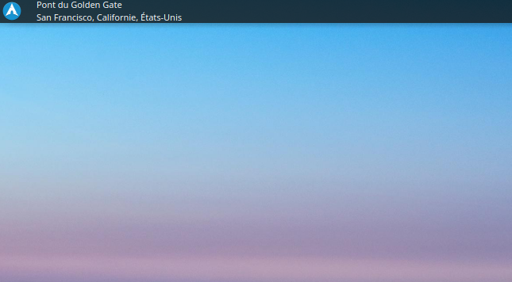
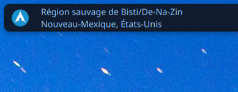

# Title bing wallpaper

A simple KDE widget that shows the title information about the Bing Picture of the Day wallpaper. If you want to know more about the Bing Picture of the Day, you can click on the widget and it will open your default browser with more information about the picture.

## Installation or update

Clone the repository and run the following commands for installing or updating the widget:

```
git clone git@github.com:victorballester7/title-bing-wallpaper.git
cd title-bing-wallpaper
chmod +x install.sh
./install.sh
cd ..
rm -rf title-bing-wallpaper
```

If you don't have ssh keys configured, you can use https instead:

```
git clone https://github.com/victorballester7/title-bing-wallpaper.git
cd title-bing-wallpaper
chmod +x install.sh
./install.sh
cd ..
rm -rf title-bing-wallpaper
```

## Photos

Here are some photos of how the widget looks like:



A widget in a Latte Dock panel in French.

<br></br>


A widget in the desktop in English and in one line mode.



A widget in a panel of Plasma 6 in French (coloured by another widget)
